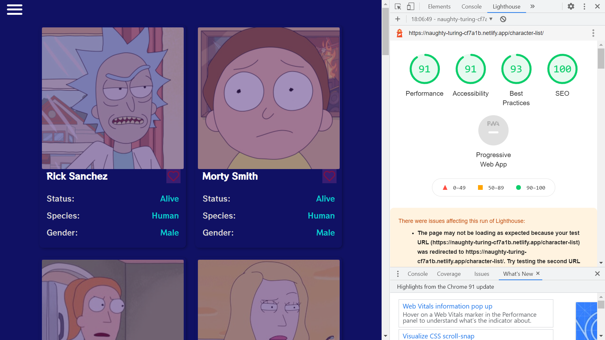

# :zap: Angular GraphQL Data

* Angular app to display data from Rick and Morty API using GraphQL with Apollo.
* Server Side Rendering (SSR) added.
* Deployed to Netlify with a good (green) Lighthouse score.
* **Note:** to open web links in a new window use: _ctrl+click on link_


## :page_facing_up: Table of contents

* [Angular GraphQL Data](#angular-graphql-data)
  * [:page_facing_up: Table of contents](#page_facing_up-table-of-contents)
  * [:books: General info](#books-general-info)
  * [:camera: Screenshots](#camera-screenshots)
  * [:signal_strength: Technologies](#signal_strength-technologies)
  * [:floppy_disk: Setup](#floppy_disk-setup)
  * [:computer: Code Examples](#computer-code-examples)
  * [:cool: Features](#cool-features)
  * [:clipboard: Status & To-Do List](#clipboard-status--to-do-list)
  * [:clap: Inspiration](#clap-inspiration)
  * [:file_folder: License](#file_folder-license)
  * [:envelope: Contact](#envelope-contact)
## :books: General info

* GraphQL, a query language for APIs.
* Angular [HttpInterceptor](https://angular.io/api/common/http/HttpInterceptor) used to intercept a HTTP request and show a spinner
* Styling done using SCSS instead of Angular Material, Bootstrap, Tailwind etc.
* Dummy robots.txt file added to fool lighthouse test for Search Engine Optimization (SEO)

## :camera: Screenshots



## :signal_strength: Technologies

* [Angular framework v12](https://angular.io/)
* [Angular Universal v12](https://angular.io/guide/universal) Server-Side Rendering(SSR) by a Node Express web server
* [Angular Express Engine v12](https://www.npmjs.com/package/@nguniversal/express-engine) for running Angular Apps on the server for server side rendering
* [SCSS/SASS](https://sass-lang.com/) CSS extension language
* [Apollo Angular v2](https://apollo-angular.com/docs/)
* [ngx-toastr v14](https://www.npmjs.com/package/ngx-toastr) for popup user messages
* [ngx-infinite scroll v10](https://www.npmjs.com/package/ngx-infinite-scroll)
* [Google Chrome Lighthouse](https://developers.google.com/web/tools/lighthouse) to check quality of website
* [Source of emojis](https://emojipedia.org/)

## :floppy_disk: Setup

* Install dependencies using `npm i`
* Run `npm outdated` to see if any npm dependencies are outdated.
* Run `ng serve` for a non-SSR dev server. Frontend will open at `http://localhost:4200/` - refreshes on code changes
* Run `npm run dev:ssr` for an SSR dev server. Frontend will open at `http://localhost:4200/` - refreshes on code changes
* Run `npm run lint` to lint test entire codebase using ESLint.
* Run `npm run build` to generate a build file without SSR
* Run `npm run build:ssr` to generate a build file with SSR. Add `defer` to browser css file ref.
* Run `npm run serve:ssr` to see on a dev server `http://localhost:4000`

## :wrench: Testing

* Run `ng test` to run Jasmine unit tests via [Karma](https://karma-runner.github.io)
* Run `ng e2e` to execute the end-to-end tests via [Protractor](http://www.protractortest.org/).

## :computer: Code Examples

* `data.service.ts` function to get API data using GraphQL & Apollo

```typescript
  getCharactersByPage(pageNum: number): void {
    const QUERY_BY_PAGE = gql`{
      characters(page: ${pageNum}) {
        results {
          id
          name
          status
          species
          gender
          image
        }
      }
    }`;

    this.apollo.watchQuery<any>({
      query: QUERY_BY_PAGE
    }).valueChanges.pipe(
      take(1),
      pluck('data', 'characters'),
      withLatestFrom(this.characters$),
      tap(([apiResponse, characters]) => {
        this.parseCharactersData([...characters, ...apiResponse.results]);
      })
    ).subscribe();

  }
```

## :cool: Features - Frontend

* [Angular Universal](https://angular.io/guide/universal) used to generate static pages using Server Side Rendering (SSR) - to increase display speed and add Search Engine Optimisation (SEO). _A normal Angular application executes in the browser, rendering pages in the DOM in response to user actions. Angular Universal executes on the server, generating static application pages that later get bootstrapped on the client. This means that the application generally renders more quickly, giving users a chance to view the application layout before it becomes fully interactive._

## :clipboard: Status, Testing & To-Do List

* Status: Working with SSR. [Deployed to Netlify](https://naughty-turing-cf7a1b.netlify.app/character-list)
* Testing: n/a
* To-Do: turn strict back on and sort type errors. Improve Lighthouse score. Add PWA?

## :clap: Inspiration/General Tools

* [Tutorial de Angular 11 desde cero 📕 Curso Angular en Español - Graphql API Rick and Morty](https://www.youtube.com/watch?v=dy6GEHWLwrs)
* [Manejar Local Storage con Angular 11 - #2](https://www.youtube.com/watch?v=PgI3jo95F5c)
* [#angular Instalar NGX-TOASTR 🔔 en Angular 11 #3](https://www.youtube.com/watch?v=7UJw-PJjKuk&t=8s)
* [Scroll Infinito Angular 11 - Angular curso #4](https://www.youtube.com/watch?v=bAnUkyawtAY)
* [Efecto de carga en Angular spinner, loading - Curso práctico Angular 11 #5](https://www.youtube.com/watch?v=uQprcZ0FYMw)
* [Recuperamos details - Aplicación Ricky and morty API - Angular 11](https://www.youtube.com/watch?v=70jrlNJ3YsM)
* [¿Qué es angular universal? - Server Side Rendering (SSR) con Angular Universal](https://www.youtube.com/watch?v=2eksE5hlbmQ)
* [Primeros pasos con netlify y angular SSR](https://www.youtube.com/watch?v=Zshv21H1M2A)
* [THIRUVANANTHAPURAM: How to add eslint to angular 12 project](https://www.youtube.com/watch?v=Km7RuJEfE0c)
* [Stackoverflow: argument-of-type-null-is-not-assignable-to-parameter-angular](https://stackoverflow.com/questions/67025848/argument-of-type-null-is-not-assignable-to-parameter-angular)

## :file_folder: License

* N/A

## :envelope: Contact

* Repo created by [ABateman](https://github.com/AndrewJBateman), email: gomezbateman@yahoo.com
