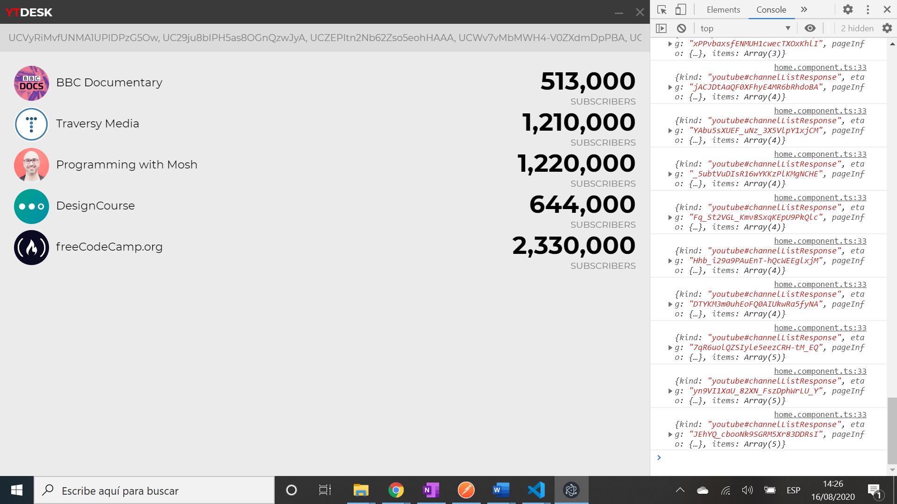

# :zap: Angular Data Charts

* Fully working native desktop app produced using Angular front-end framework and Electron. Uses Youtube API data to show subscribers to a Youtube channel, based on a Youtube channel id.

*** Note: to open web links in a new window use: _ctrl+click on link_**

## :page_facing_up: Table of contents

* [:zap: Angular Data Charts](#zap-angular-data-charts)
  * [:page_facing_up: Table of contents](#page_facing_up-table-of-contents)
  * [:books: General info](#books-general-info)
  * [:camera: Screenshots](#camera-screenshots)
  * [:signal_strength: Technologies](#signal_strength-technologies)
  * [:floppy_disk: Setup](#floppy_disk-setup)
  * [:computer: Code Examples](#computer-code-examples)
  * [:cool: Features](#cool-features)
    * [With Maxime GRIS boilerplate code used in this app used it is possible to](#with-maxime-gris-boilerplate-code-used-in-this-app-used-it-is-possible-to)
  * [:clipboard: Status & To-Do List](#clipboard-status--to-do-list)
  * [:clap: Inspiration](#clap-inspiration)
  * [:envelope: Contact](#envelope-contact)

## :books: General info

* [Maxime GRIS boilerplate code used in this app](https://github.com/maximegris/angular-electron) used to save time creating this desktop app that uses Angular 10 and Electron 9 (Typescript + SASS + Hot Reload).
* The application code is managed by `main.ts`.
* You can disable "Developer Tools" by commenting `win.webContents.openDevTools();` in `main.ts`.

## :camera: Screenshots



## :signal_strength: Technologies

* [Angular v10](https://angular.io/)
* [Electron v9](https://www.electronjs.org/) cross-platform desktop apps with JavaScript, HTML, and CSS
* [Electron Builder v22](https://www.electron.build/) to package and build a ready for distribution Electron app for macOS, Windows and Linux with “auto update” support out of the box.
* [Node v12](https://nodejs.org/en/) required by Angular 10.x CLI

## :floppy_disk: Setup

* Install dependencies by running `npm i`
* Run `npm start` for a dev server. Navigate to `http://localhost:4200/`. The app will automatically reload if you change any of the source files
* Run `ng build` to build the project. The build artifacts will be stored in the `dist/` directory. Use the `--prod` flag for a production build
* Run`npm run ng:serve` to Execute the app in the browser
* Run `npm run build` to Build the app. Your built files are in the /dist folder.
* Run `npm run build:prod` to Build the app with Angular aot. Your built files are in the /dist folder.
* Run `npm run electron:local`to build your application and start electron.
* Run `npm run electron:build` to build your application and create an app consumable based on your operating system.
* Run `npm run e2e`TO Execute end to end tests

## :computer: Code Examples

* extract from `data.service` to get Youtube data based on Youtube client ID (publically available).

```typescript
// eslint-disable-next-line @typescript-eslint/explicit-module-boundary-types
  getStats(name: string) {
    return interval(5000).pipe(
      startWith(0),
      switchMap(() =>
        this.http.get(
          "https://www.googleapis.com/youtube/v3/channels?part=statistics,snippet&id=" +
            name +
            "&key=KEY"
        )
      ),
      map((res) => res)
    );
  }
```

## :cool: Features

### With [Maxime GRIS boilerplate code used in this app](https://github.com/maximegris/angular-electron) used it is possible to

* Run your app in a local development environment with Electron & Hot reload (rendering process only, not electron process)
* Run your app in a production environment
* Package your app into an executable file for Linux, Windows & Mac

## :clipboard: Status & To-Do List

* Status: in work
* To-Do: add dotenv, create build file and complete.

## :clap: Inspiration

* [Gary Simon tutorial DesignCourse Youtube video](https://www.youtube.com/watch?v=Ea2lWsumTrM)
* [Maxime GRIS boilerplate code used in this app](https://github.com/maximegris/angular-electron)
* [Youtube Data API Reference](https://developers.google.com/youtube/v3/docs)

## :envelope: Contact

* Repo created by [ABateman](https://www.andrewbateman.org) - you are welcome to [send me a message](https://andrewbateman.org/contact)
